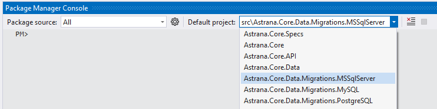
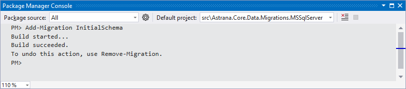
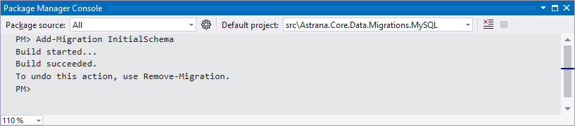

# Astrana.Core.Data

This project should only house code and resources that define the 
system data model and provide interfaces for accessing application data.

### Adding Data Model Migrations

To add a new migration:

1. Open the Nuget Package Manager Console inside Visual Studio.

2. In the Package Manager Console, select the Visual Studio project that corresponds to the desired database to create the migration for.
<br /><br />


3. In the Astrana.Core.Application project, set the `DatabaseProvider` setting to the desired database name in the AppSettings.json file.

4. Execute the `Add-Migration` command to create the migration : 

``` Powershell
Add-Migration SomeSensibleMigrationName
```

<figure class="image">
  
  <figcaption><b><small>Example: Add Migration - Microsoft SQL Server</small></b></figcaption>
</figure>

<figure class="image">
  
  <figcaption><b><small>Example: Add Migration - PostgreSQL</small></b></figcaption>
</figure>

<figure class="image">
  
  <figcaption><b><small>Example: Add Migration - MySQL</small></b></figcaption>
</figure>

5. Execute the `Update-Database` command to apply the migration to the database: 

``` Powershell
Update-Database
```